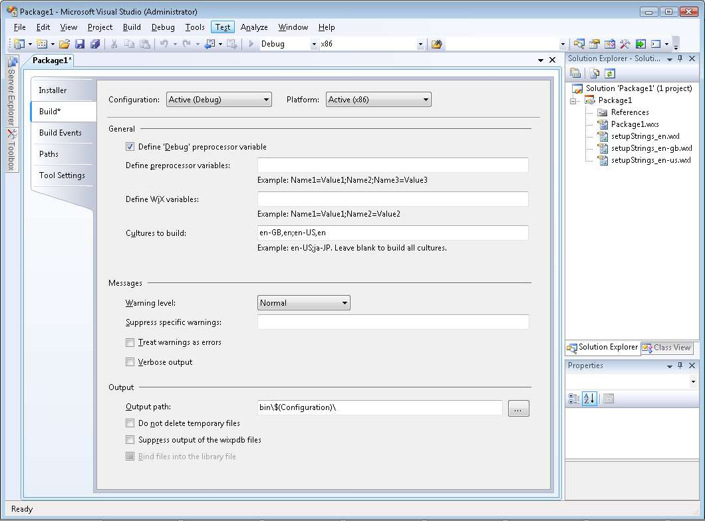

## Specifying Cultures to build on the Command Line

You can specify a specific culture for light.exe to build using the culture switch:

    light.exe myinstaller.wixobj -cultures:en-us -ext WixUIExtension 
    -out myinstaller-en-us.msi

This will cause light to build an en-us installer using the en-us resources from
WixUIExtension.

You can still use cultures when specifying localization files:

    light.exe myinstaller.wixobj -cultures:en-us -loc mystrings_en-US.wxl 
    -loc mystrings_fr-FR.wxl -out myinstaller-en-us.msi

This will cause light to build an en-us installer using the en-us resources from
the specified en-US .wxl file. Note that when specifying -cultures any wxl files
specified with the -loc switch that do not map will be ignored (mystrings\_fr-FR.wxl
in this case.)

The neutral (invariant) culture can be specified by using *neutral*:

    light.exe myinstaller.wixobj -cultures:neutral -loc mystrings_en-US.wxl 
    -loc mystrings_fr-FR.wxl -loc mystrings.wxl -out myinstaller.msi

This will cause light to build a neutral installer using the neutral resources from
the mystrings.wxl file. 

You can use cultures and localization files together to specify fallback cultures:

    light.exe myinstaller.wixobj -cultures:en-us;en -loc mystrings_en-US.wxl 
    -loc mystrings_en.wxl -ext WixUIExtension -out myinstaller-en-us.msi

This will cause light to build an en-us installer first using localization variables
from the en-US localization file (mystrings\_en-US.wxl), then the en localization
file (mystrings\_en.wxl), then finally WixUIExtension.

## Specifying Cultures to build in Visual Studio
During the development of your installer you may want to temporarily disable building
some of the languages to speed up build time. You can do this by going to
**Project** > <em><strong>Projectname</strong></em> **Properties** on the menu
and selecting the <strong>Build</strong> tab. In the **Cultures to build**
field enter the semicolon list of cultures or culture groups you would like built.

**Cultures to build** may be used to specify cultures to build when
a .wxl file is not provided for a target culture. For example, to build an en-US
installer and an ru-RU installer when only an ru-RU .wxl file is provided, specify
en-US;ru-RU. Wix localization variables for the ru-RU installer will first come
from the provided .wxl file, then referenced WiX extensions (IE: WixUIExtension).
Wix localization variables for the en-US installer will only come from referenced
extensions.

The neutral (invariant) culture can be specified by using *neutral*. 
To build English (United States), French (France), and neutral installers specify 
the following:

    en-US;fr-FR;neutral

**Cultures to build** may also be used to specify how to use multiple
WxL files to build a single installer. Each culture or culture group will build
an individual MSI. A **culture group** consists of a list of cultures
separated by *commas* and is useful for specifying fallback cultures used to locate
WiX localization variables.  Multiple culture groups may be separated by *semi-colons*
to build multiple outputs.

    primary1,fallback1;primary2,fallback2

The example below demonstrates the settings needed to build two installers from
three .wxl files. Both en-US and en-GB installers will be built, using three localization
files: setupStrings\_en-US.wxl, setupStrings\_en-GB.wxl, and setupStrings\_en.wxl.
The sample uses two culture groups to share the neutral English translations between
both of the fully localized installers.

